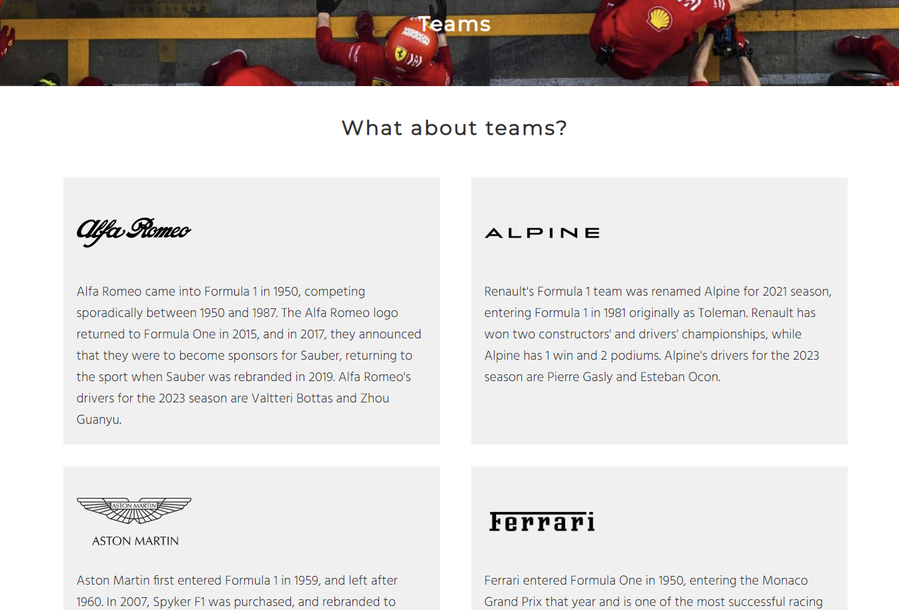

<a href="https://lanacreegan.github.io/Formula-1/">Formual 1 website</a>

## Introduction

This is the website for Formula 1, which has information on the history of the sport, what it’s about and its teams. The website is for people who are new to the sport and want to learn more about it. 

## User Stories

  ### First Time User
   #### As a first time user of the website I want to
   - Learn about the history of Formula 1
   - Watch a video to see what happens in a race

 #### As a returning user of the website I want to
  - Have a better understanding of the sport
  - Know more about the teams and drivers
  - Sign up to the newsletter to keep up to date with news about Formula 1

## Design
 ### Colour
 The colour on the website is based around the hero images, which are the Ferrari cars #D40000. I then chose colours that complimented this colour and were neutral so it made the red stand out and be eye catching. 

 ### Font
 Hind is used for the headings and Montserrat is used for the main text. Sans-serif is used as the backup text. These fonts were chosen to give the website a simple but modern look. 

## Wireframes 
 The wireframes for the websites can be found below. I decided not to put text above the social media links in the footer as I preferred the look without text. I also put text on in hero image in the center instead of to the right and moved the logo to the right and menu to the left as I also preferred how this looked.
 - [Wireframe 1](./assets/images/readme-images/wireframe-1.png)
 - [Wireframe 2](./assets/images/readme-images/wireframe-2.png)
 - [Wireframe 3](./assets/images/readme-images/wireframe-3.png)

## Features
 ### Navigation Bar
 - The navigation bar features on all 3 pages 
 - The page that the user is on is underlined 
   

 ### Hero image 
 - The home page and teams page both contain hero images
 
 
 
 ### What is Formula 1
 - This section contains a brief history of 3 time periods within Formula 1 
 - Each section has an image of a Formula 1 car that matches these time periods 
 

 ### Race highlights
 - A Youtube video has been added of race highlights of the Sao Paulo Grand Prix so users can see what happens in a race
 

### About Teams 
 - This section contains 2x5 boxes 
 - These boxes contain information about each team along with an image of the team logo 
 

 ### Newletter  
 - Contains a form with a sign up button in which the user can provide their name and email to sign up to a newsletter
  

 ### Thank you 
 - Contact page refreshes after entering in name and email in sign up form to show a thank you message 
 

 ### Footer
 - Features on all 3 pages
 - Conatains icons that link to their corresponding socail media websites
 - Also features a disclaimer 
 

## Technologies
### Testing
The W3C Markup Validation Service was used to validate the HTML of the website, which passed with no errors and warnings
- [HTML Validator 1](./assets/images/readme-images/html-validator-1.png)
- [HTML Validator 2](./assets/images/readme-images/html-validator-2.png)
- [HTML Validator 3](./assets/images/readme-images/html-validator-3.png)
- [HTML Validator 4](./assets/images/readme-images/html-validator-4.png)

The W3C CSS Validation Service was used to validate the CSS of the website, which passed with no errors. There was one warning which relates to the imported style sheets for Google Fonts.
- [CSS Validator](./assets/images/readme-images/css-validator.png)

Lighthouse was used to test the performance
- [Home Page lighthouse](./assets/images/readme-images/home-page-lighthouse.png)
- [Teams Page lighthouse](./assets/images/readme-images/teams-page-lighthouse.png)
- [Contact Page lighthouse](./assets/images/readme-images/contact-page-lighthouse.png)

## User Stories 
### First time user 
As a first time user, I want to see if I can find out information about Formula 1
- This is done by the hero image which contains an eye catching red car, along with text on the bottom saying a beginners guide to Formula 1

As a first time user, I want to learn more about the history of Formula 1
- This is done by the heading "What is Formula 1?" Under this heading there is three sections with descriptions about three different time periods within the sport and images of Formula 1 cars alongside the descriptions that match up with the relevant time periods

As a first time user, I want to see what happens in a race
- This is done by a Youtube video of the Sao Paulo Grand Prix highlights underneath the heading "Check out some race highlights below"

### Returning user
As a returning user, I want to know more about the teams
- This is done by the "What about teams?" section in the teams page. Under the "What about teams?" heading there is 5 boxes in rows of 2, with descriptions about each team, who is driving for each team and an image of their logo

As a returning user, I want to keep up to date about news in Formula 1
- This is done by a form in the Contact page. Users can enter their name and email to sign up to a newsletter. Once they press the sign up button the page reloads with a message to let them know the sign up was successful

## Further testing
The following was tested regularly
- Social media links in the footer of the page
- Newsletter form so user is brought to a thank you page

The website was tested on the following browsers
- Google Chrome
- Safari
- Microsoft Edge

The website was tested on the following devices
- iPhone
- Samsung Galaxy S22
- ASUS 15" laptop

## Known bugs
- The logo had a hyperlink underline. It was fixed by adding psuedo classes hover, visited, link, active.
- There was a gap to the right of the hero image leaving a white space. This was fixed by adding a height of 80vh
- Not being able to see text that was typed into the name section of the newsletter form. This was fixed by changing the colour  to #323031
- The Youtube video overflowing the screen when being viewd on mobile. This was fixed by adding media query width of 100%

# Deployment 
## GitHub Pages
The project was deployed to GitHub Pages by following these steps 
 - Log in to GitHub and go to the GitHub Repository. 
 - Navigate to the settings tab. 
 - Scroll down to pages under the Code and Automation section. 
 - Under branch select main 
 - The page automatically refreshes and the link for the website is displayed at the top of the pages section 

 ## Fork
 The repository can be forked by following these steps
 - Log into GitHub and go to the GitHub Repository 
 - Locate fork in the top right hand corner of the page and click on it
 - Select an owner for the forked repository 
 - Then select if you want to copy the default branch or all branches to the new fork
 - Click create fork

 ## Clone
 The repository can be cloned by following these steps
 - Log into GitHub and go to the GitHub Repository 
 - Click on the code button on the right above the files list
 - Then select HTTPS and copy the URL
 - Open Git Bash
 - Change the current working to the location you want the cloned directory to be
 - Type git clone and paste the URL from earlier
 - Press enter to create the local clone

# Credit 
## Content
Content for the website was from the following websites
- History of fourmula 1 came from <a href="https://en.wikipedia.org/wiki/Formula_One#:~:text=History,-Main%20article%3A%20History&text=The%20Formula%20One%20series%20originated,races%20taking%20place%20that%20year.">here</a>
- Ferrari came from <a href="https://www.creditplus.co.uk/blog/history-of-ferrari-in-formula-one/">here</a>
- Alpine came from <a href="https://f1experiences.com/blog/team-enstone-tracing-the-roots-of-the-alpine-f1-team">here</a>
- Aston Martin came from <a href="https://boardroom.tv/aston-martin-f1-team/">here</a>
- Haas came from <a href="https://www.motorsportmagazine.com/database/teams/haas-formula-1-team/">here</a>
- McLaren came from <a href="https://www.motorsportmagazine.com/database/teams/mclaren/">here</a>
- Mercedes came from <a href="https://en.wikipedia.org/wiki/Mercedes-Benz_in_Formula_One">here</a>
- Red Bull came from <a href="https://en.wikipedia.org/wiki/Red_Bull_Racing">here</a>
- Alpha Tauri came from <a href="https://en.wikipedia.org/wiki/Scuderia_AlphaTauri">here</a> and <a href="https://en.wikipedia.org/wiki/Scuderia_Toro_Rosso">here</a>
- Alfa Romeo came from <a href="https://en.wikipedia.org/wiki/Alfa_Romeo_in_Formula_One">here</a>
- Willaims came from <a href="https://www.racefans.net/f1-information/f1-teams/williams/">here</a> and <a href="https://en.wikipedia.org/wiki/Williams_Grand_Prix_Engineering#:~:text=The%20team%20was%20formed%20in,and%20original%20owner%2C%20Frank%20Williams.">here</a>

## Media
- Ferrari hero image from <a href="https://unsplash.com/photos/B87zMorEZRo">here</a>
- Old F1 car from <a href="https://unsplash.com/photos/licYp8spO1A">here</a>
- Middle F1 car from <a href="https://unsplash.com/photos/BFP_ApRwBI0">here</a>
- New F1 car from <a href="https://unsplash.com/photos/g7V4CYl_nos">here</a>
- Ferrari logo from <a href="https://seeklogo.com/vector-logo/53755/ferrari">here</a>
- Alpine logo from <a href="https://seeklogo.com/vector-logo/400196/alpine">here</a>
- Aston Martin logo from <a href="https://seeklogo.com/vector-logo/12500/aston-martin">here</a>
- Haas logo from <a href="https://seeklogo.com/vector-logo/395650/haas-f1-team">here</a>
- McLaren logo from <a href="https://seeklogo.com/vector-logo/379404/mclaren">here</a>
- Mercedes logo from <a href="https://seeklogo.com/vector-logo/406797/mercedes-amg-f1">here</a>
- Red Bull logo from <a href="https://seeklogo.com/vector-logo/406796/red-bull-racing-f1">here</a>
- Alpha Tauri logo from <a href="https://seeklogo.com/vector-logo/423760/scuderia-alpha-tauri">here</a>
- Alfa Romeo logo from <a href="https://seeklogo.com/vector-logo/286039/alfa-romeo">here</a>
- Williams logo from <a href="https://seeklogo.com/vector-logo/410093/williams-racing">here</a>

## Code
- Flex box tutorial came from <a href="https://css-tricks.com/snippets/css/a-guide-to-flexbox/">here</a> 
- Code to remove underline from logo came from <a href="https://stackoverflow.com/questions/2789703/remove-blue-underline-from-link">here</a>
- Newsletter form was based on the Love Running walkthrough project
 

 